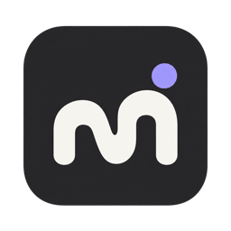

<p align="center">
  
</p>
<h1 align="center">Morrow</h1>
<p align="center"><strong>让 Codex 持续负责一个项目的目标。</strong></p>
<p align="center">
  <a href="#快速开始">快速开始</a> ·
  <a href="docs/README.md">文档</a> ·
  <a href="docs/CORE-MECHANISM.md">核心机制</a>
</p>

Morrow 是一个本地优先的 Mac 应用。打开已有项目，说明想达到的结果，Codex 就能在同一个原生任务中持续理解现状、选择行动、执行验证，并根据反馈调整下一步。你可以随时通过对话指导它，在上线前审阅并确认具体版本。

- **围绕目标持续工作**：保留项目认识、行动依据和经验，支持反馈唤醒、等待与预算约束。
- **一个项目，一份共享看板**：AI 自动维护每个 feature 的来源频道、尝试、证据、发布与后续效果。
- **原生 Codex 对话**：与 Codex App 使用同一任务；认证、模型、工具和执行由原生运行时管理。
- **上线前有据可审**：呈现改动、预期收益、验证结果、风险与回退计划，由人确认对应发布版本。

框架已提供持续工作与反馈闭环的支撑机制；实际项目仍需接入自己的监控和发布能力，长期自主效果需要真实环境验证。详见 [能力边界](docs/RUNTIMES.md)。

## 快速开始

需要 **macOS 14+、Node.js 24+、npm、Xcode Command Line Tools**。使用 Codex 时，先安装并登录 Codex Mac App。

```bash
git clone https://github.com/AniChikage/Morrow.git
cd Morrow
npm ci
npm run build:app
bash scripts/install-app.sh
open "$HOME/Applications/Morrow.app"
```

1. 打开已有项目文件夹，写下目标。默认频道处于暂停状态，接入不会立即执行。
2. 在设置中配置 Codex 后台连接；首次配置后，在当前任务结束时重开一次 Codex App。
3. 点击「开始工作」。之后直接在 Morrow 对话、查看项目看板，并审阅上线确认。

构建输出为 `dist/Morrow.app`，默认安装到 `~/Applications/Morrow.app`，已包含 Node 运行时。当前为本机 ad-hoc 签名构建。完整步骤见 [使用指南](docs/GETTING-STARTED.md)；旧用户见 [从 NoHuman 升级](docs/UPGRADING.md)。

## 开发

```bash
npm run dev:ui  # 浏览器预览，使用明确标注的示例数据
```

Electron 隔离开发、测试和打包方式见 [开发指南](docs/DEVELOPMENT.md)。

## 文档

| 想了解什么 | 从这里开始 |
| --- | --- |
| 如何持续理解、行动、验证和改进 | [核心机制与流程图](docs/CORE-MECHANISM.md) |
| 如何连接原生任务、保存数据 | [架构与数据](docs/ARCHITECTURE.md) · [运行时](docs/RUNTIMES.md) |
| AI 如何维护项目、反馈和发布 | [项目工作协议](docs/PROJECT-WORK-CONTRACT.md) |
| 产品方向、理论依据与验收记录 | [文档目录](docs/README.md) |
