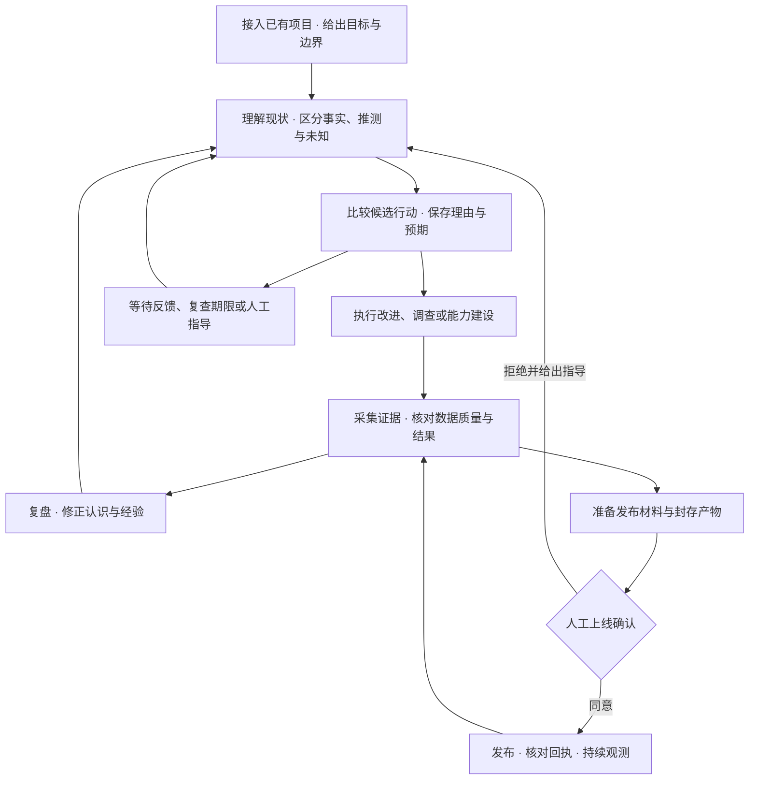

# 核心机制

[文档首页](README.md) · [产品方向](PRODUCT-DIRECTION.md) · [接口协议](PROJECT-WORK-CONTRACT.md)

用户给出项目、目标、资源和授权范围。Codex 负责判断下一步值得做什么：改进功能、调查问题、补齐打点或工具、等待更多信息，或者停止一项没有价值的尝试。

## 项目、频道与看板

- **项目**对应一个已有的本地或远程文件夹，拥有一个共享的功能看板。
- **频道**承载持续责任与对话，位于具体项目下面。一个默认频道就可以开始，之后按需要调整方向。
- **Feature**追踪一次改进的完整过程：来源频道、判断、尝试、证据、发布和反馈。同项目频道可以协作推进同一个事项。
- **原生任务**承载真实执行。Codex 的自动工作与人工指导沿用同一个任务，消息、工具活动和运行记录保留原生 ID。

界面采用受 Multica 启发的灰白工作区：项目侧栏、紧凑列表、标签页、中央文档与窄属性栏。项目名称可点击展开，下面先是看板，再是频道。

## 已实现的支撑机制

| 机制 | 当前行为 |
| --- | --- |
| 项目认识与行动选择 | 保存认识版本、候选行动、选择理由、预期、约束与尝试预算；目标、指导或依据变化后要求复查。 |
| 证据与效果核对 | 保存真实文件、HTTP 观测与受支持的原生执行证据；核对观察窗口、来源、规则和源码版本。完成申请需要相应的独立复核。 |
| 测量与数据质量 | 可冻结指标口径、基线、数据时间及样本/完整性等检查规则；支持绝对值和差值。过期、缺失或不合格的数据保留为未知。 |
| 反馈驱动的继续工作 | HTTP JSON 变化、发布回执和复查期限可唤醒工作；重复相同反馈保持安静，手动暂停后不会自动重启。 |
| 经验复用与修正 | 按当前方向召回项目内认识、复盘与学习记录，保留证据和引用版本；经验失效后重新评估。 |
| 资源与工作协调 | 同项目目录的责任轮次串行执行；支持继续、等待、提问和暂停，并遵守复查间隔与每日轮次上限。 |
| 上线确认 | 展示改动、预期收益、验证证据、影响与风险、回退和观察计划；确认后只发布对应的封存产物，核对实际回执。 |
| 持久记录 | 项目、频道、看板、运行 I/O、原生同步、证据、决策、复盘和发布记录保存在 SQLite，保留关联与历史。 |

**打点和反馈是行动设计的一部分。** Codex 可以先调查现有观测能力、补齐缺口，再实施改进。Morrow 保存测量约定并核对采集结果；具体项目的埋点、采集工具和线上数据源仍需实际接入。

## 能力与验收边界

这里描述的是当前框架已经提供的机制。测试通过、模型复核通过与业务结果改善是不同层次的证据，不能相互替代。长期无人值守的自主性仍需要在实际项目、真实反馈和资源约束下验证；研究提案不等于已上线能力。

运行时、发布与数据接入的具体限制见 [原生运行时](RUNTIMES.md)，理论依据与待验证提案见 [认知架构](COGNITIVE-ARCHITECTURE.md)。
